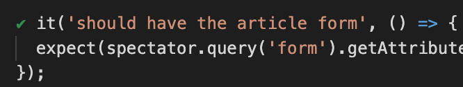

# Test Reference App with Jest, Spectator

The purpose of this project is to be used in the Rabobank component testing sessions with [Jest](https://jestjs.io/) and with [Spectator](https://ngneat.github.io/spectator/) to write frontend integration tests.

## Prerequisites
<details>
  <summary>Details</summary>

<br>

### Tools needed
* Git
* Node (12.x)
* npm (6.x)
* latest Google Chrome
* GitHub account
### Tools recommended
* Recommended downloading Visual Studio Code: https://code.visualstudio.com/
  * install the following extensions:
  * [EditorConfig](https://marketplace.visualstudio.com/items?itemName=EditorConfig.EditorConfig)
  * [TSLint](https://marketplace.visualstudio.com/items?itemName=eg2.tslint)
  * [Angular Language Service](https://marketplace.visualstudio.com/items?itemName=Angular.ng-template)
  * [vscode-icons](https://marketplace.visualstudio.com/items?itemName=robertohuertasm.vscode-icons)
  * [vscode-jest](https://marketplace.visualstudio.com/items?itemName=orta.vscode-jest)
</details>
<br>

## Setup

<details>
<summary>Details</summary>
<br>

### Configure Project
You will need to do the following:
* fork this repo to your GitHub account

### Verify

The following commands should work:

### Run App Locally :rocket:
Run `npm start` for a dev server. Navigate to `http://localhost:4200/`. The app will automatically reload if you change any of the source files.

### Run Unit Tests
Run `npm test` to execute the unit tests via [Jest](https://jestjs.io/) and [Spectator](https://ngneat.github.io/spectator/)

Run tests in watch mode:
```sh
npm run test:watch
```

</details>
<br>

## 1) Test structure
<details>
  <summary>Details</summary>

<br>

### Unit Testing Best Practices

1. **Always Write Isolated Test Cases**  
The order of execution has to be independent between test cases.
2. **Test One Thing Only in One Test Case**  
If a method has several end results, each one should be tested separately.
Whenever a bug occurs, it will help you locate the source of the problem.
**:(**
```javascript
it('should send the data to the server and update the view properly', () => 
{
  // expect(...)to(...);
  // expect(...)to(...);
});
```
**:)**
```javascript
it('should send the data to the server', () => {
  // expect(...)to(...);
});

it('should update the view properly', () => {
  // expect(...)to(...);
});
```
Be aware that writing "AND" or "OR" when naming your test smells bad...

3. **Describe your tests properly**  
This helps to avoid comments and increases the maintainability and in the case a test fails you know faster what functionality has been broken. Keep in mind that someone else will read it too.
Tests can be the live documentation of the code.  

In order to help you write test names properly, you can use the "unit of work - scenario/context - expected behaviour" pattern:

```javascript
describe('[unit of work]', () => {
  it('should [expected behaviour] when [scenario/context]', () => {
  });
});
```
Or whenever you have many tests that follow the same scenario or are related to the same context:

```javascript
describe('[unit of work]', () => {
  describe('when [scenario/context]', () => {
    it('should [expected behaviour]', () => {
    });
  });
});
```

```javascript
describe("binding dependencies", () => {
  it("should remove handler when element was removed", () => {
    // code
  });

  it("should add handler when element was added", () => {
    // code
  })
})
```
In Angular you can also use describe statement to separate unit tests, template shallow tests and integration tests:
Even better to prevent big files you can create seperate spec files for them.

```javascript
describe('unit tests', () => {
  describe('[unit of work]', () => {
    describe('when [scenario/context]', () => {
      it('should [expected behaviour]', () => {
      });
    });
  });
});

describe('template shallow tests', () => {
  describe('[unit of work]', () => {
    describe('when [scenario/context]', () => {
      it('should [expected behaviour]', () => {
      });
    });
  });
});

describe('integration tests', () => {
  describe('[unit of work]', () => {
    describe('when [scenario/context]', () => {
      it('should [expected behaviour]', () => {
      });
    });
  });
});
```

4. **Use the Arrange-Act-Assert Style**
- Arrange the data / mocks
- Perform an action
- Assert 
5. **Measure Code Coverage to Find Missing Test Cases**  
6. **Don't Forget to Refactor the Test Code**
Also maintain your test code (especially when after refactoring the code under test).
7. **Limit Use of Mocks**  
In some cases absolutely necessary, but with better design stubs should be enough.  
*Mocks vs stubs*  
*Mock* objects are used to define *expectations* i.e: In this scenario I expect method A() to be called with such and such parameters.Mocks record and verify such expectations.
*Stubs*, on the other hand have a different purpose: they do not record or verify expectations, but rather allow us to *“replace”* the behavior, state of the “fake” object in order to utilize a test scenario.
8. **Avoud logic in tests**  
**:(**
```javascript
it('should properly sanitize strings', () => {
  let result;
  const testValues = {
    'Avion'         : 'Avi' + String.fromCharCode(243) + 'n',
    'The-space'     : 'The space',
    'Weird-chars-'  : 'Weird chars!!',
    'file-name.zip' : 'file name.zip',
    'my-name.zip'   : 'my.name.zip'
  };

  for (result in testValues) {
    expect( sanitizeString(testValues[result]) ).toEqual(result);
  }
});
```
**:)**
```javascript
it('should sanitize a string containing non-ASCII chars', () => {
  expect( sanitizeString('Avi'+String.fromCharCode(243)+'n') ).toEqual('Avion');
});

it('should sanitize a string containing spaces', () => {
  expect( sanitizeString('The space') ).toEqual('The-space');
});

it('should sanitize a string containing exclamation signs', () => {
  expect( sanitizeString('Weird chars!!') ).toEqual('Weird-chars-');
});

it('should sanitize a filename containing spaces', () => {
  expect( sanitizeString('file name.zip') ).toEqual('file-name.zip');
});

it('should sanitize a filename containing more than one dot', () => {
  expect( sanitizeString('my.name.zip') ).toEqual('my-name.zip');
});
```
9. **Don't write unnecessary expectations**  
Remember, unit tests are a design specification of how a certain behaviour should work, not a list of observations of everything the code happens to do.
10. **Cover the general case and the edge cases**
"Strange behaviour" usually happens at the edges... 
Remember that your tests can be the live documentation of your code.

</details>

<br>

## 2) Component Integration Test with Spectator
<details>
  <summary>Details</summary>
<br>

### Why Spectator?
* Helps remove all boilerplate required to set up test suites.
* Helps write very clean, easy, and focused tests.
* Makes query DOM elements in tests easy.
* Provides HTTP testing support.
* Provides custom matchers, e.g. toHaveClass, toBeDisabled, etc.
* Provides routing testing support.
* Provides built-in support for entry components.
* Supports auto-mocking providers.

### Tests

An example can be found [here](client/app/article-edit/article-edit.component.spec.ts). In this file unit test / shallow tests and angular integration tests are
demonstrated with usage of spectator.

Please try if you can add an integration test in the author-form.component section.

</details>

<br>

## 3) Troubleshooting
<details>
  <summary>Details</summary>

<br>

### Debugging unit tests

You can also debug your tests by adding breakpoints to the code, e.g. running JavaScript Debug Terminal in VSCode. For this install the vscode-jest plugin via the marketplace. This will also give nice visual checkmarks displaying passed/failed tests. 




</details>

<br>

## 4) ComponentHarness
<details>
  <summary>Details</summary>

<br>

### What it is
A component harness is a class that lets a test interact with a component via a supported API. 
Each harness's API interacts with a component the same way a user would. 
By using the harness API, a test insulates itself against updates to the internals of a component, such as changing its DOM structure. 
The idea for component harnesses comes from the PageObject pattern commonly used for integration testing.

Cool right? :sunglasses: An example can be found [here](client/app/author-form/author-form.harness.ts)

More documentation [here](https://material.angular.io/cdk/test-harnesses/overview)

NOTE this was introduced in Angular CDK 9 and will probably not work in Angular < 9.

</details>
